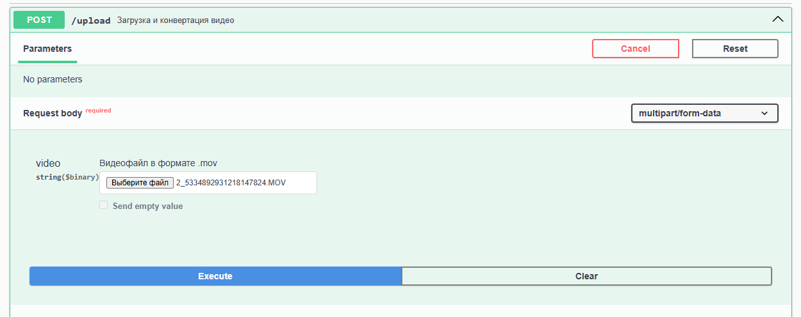
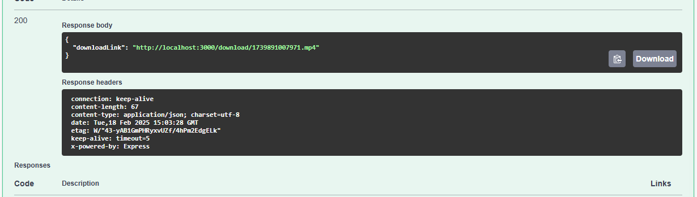
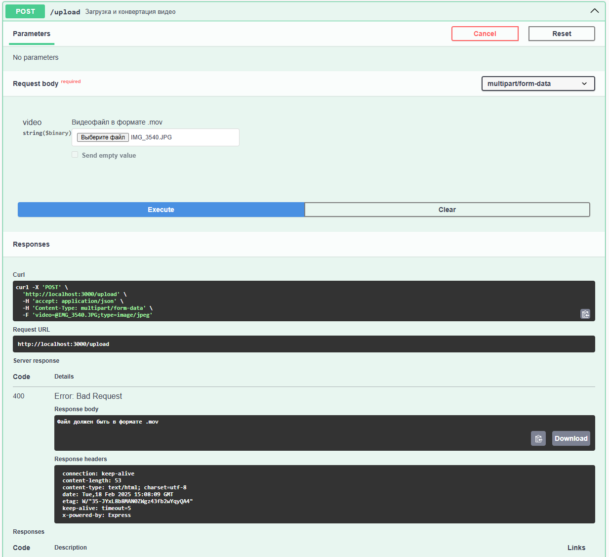
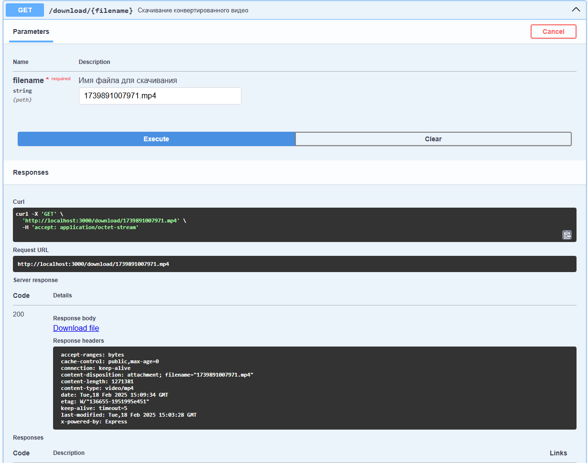

# LeadSender
Запуск 'npx tsc ' -> 'node dist/server.js'
Swagger 'http://localhost:3000/api-docs'
Необходимо в POST /upload выбрать файл и нажать Execute, как на картинке

В случае успеха файл будет сконвертирован в .mp4 и в ответе будет выданна ссылка на загрузку 

Если файл не того формата, выбрасывается ошибка 

Скачать файл можно по выданной ссылке, либо используя сваггер, введя сгенерированное имя файла 
После конвертации загруженный файл автоматически удаляется, а после скачивания пользователем удаляется и сконвертированный файл

